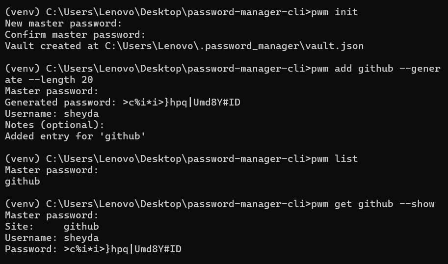

# Password Manager CLI


A secure command-line password manager that stores credentials **encrypted on disk**, protected by a single master password. Built as a learning project to practice production-grade Python: OOP, decorators, context managers, generators, custom exceptions, and real cryptography — no toy encryption.

---

## Why this exists

Most "password manager" tutorials either skip encryption entirely or roll their own cipher. This project does neither:

- The master password is **never stored** — a key is derived from it on every run using PBKDF2 (600,000 iterations).
- Every write to disk is **atomic** — a crash mid-write can't corrupt your vault.
- Every custom exception is part of one hierarchy, so the CLI can always fail with a clear message instead of a raw traceback.

---

## Demo



---

## Tech stack

- **Python 3.11+**
- [`cryptography`](https://cryptography.io/) — PBKDF2-HMAC-SHA256 key derivation + Fernet (AES-128-CBC + HMAC) encryption
- `argparse` — CLI parsing
- `pytest` — 64 tests, all vault/crypto/storage/CLI logic covered
- `dataclasses`, `secrets`, `getpass` — from the standard library only, no ORM or web framework needed

---

## Quick Start

```bash
git clone <repo-url> && cd password-manager-cli
python -m venv venv && venv\Scripts\activate   # or: source venv/bin/activate on macOS/Linux
pip install -e ".[dev]"
pwm init
```

Then try `pwm add <site>`, `pwm list`, `pwm get <site> --show`, `pwm update <site>`, `pwm delete <site>`, or `pwm generate --length 24`.

By default the vault lives at `~/.password_manager/vault.json`. Use `--vault-path <path>` on any command to point at a different file (useful for testing or multiple vaults).

---

## Project structure

```
password-manager-cli/
├── src/password_manager/
│   ├── cli.py          # argparse commands — thin layer over Vault
│   ├── vault.py         # core logic: decorator, context manager, generator
│   ├── models.py        # Entry dataclass (masked repr, to_dict/from_dict)
│   ├── crypto.py        # CryptoService — PBKDF2 key derivation + Fernet
│   ├── storage.py       # JSONStorage — atomic read/write
│   ├── generator.py      # cryptographically secure password generation
│   └── exceptions.py     # VaultError hierarchy
├── tests/                 # 64 pytest tests, all using tmp_path
├── pyproject.toml
└── requirements.txt
```

---

## How it works

1. **Key derivation** — `CryptoService` runs PBKDF2-HMAC-SHA256 (600,000 iterations) on the master password + a random 16-byte salt to produce a 256-bit key, fed to `Fernet`. The salt is stored (not secret); the master password never is.
2. **Wrong-password detection** — the vault stores a small encrypted "check" token. On open, it's decrypted and compared to a known value — this is how a wrong master password is told apart from a corrupted file.
3. **Atomic writes** — `JSONStorage.save()` writes to a `*.tmp` file first, then calls `os.replace()`. If the process is killed mid-write, the original vault file is untouched.
4. **In-memory state** — `Vault` only holds decrypted entries while unlocked. `vault.lock()` (and leaving a `with Vault.init(...) as vault:` block) clears them from memory.

**Python concepts used:**
- **Decorator** — `@require_unlocked` guards every vault operation
- **Context manager** — `Vault` implements `__enter__`/`__exit__` to auto-save and auto-lock
- **Generator** — `Vault.search()` lazily yields matching entries
- **Custom exceptions** — `VaultError` and five subclasses (`InvalidMasterPasswordError`, `CorruptedVaultError`, `VaultNotFoundError`, `EntryNotFoundError`, `DuplicateEntryError`)

---

## Security notes

**What this protects against:**
- Someone reading the vault file off disk without the master password (AES-128 via Fernet, HMAC-authenticated).
- Casual shoulder-surfing (master password input uses `getpass`, never echoed; `list`/`repr` never print real passwords).
- A crash or power loss mid-save corrupting the vault (atomic write).

**What this does *not* protect against:**
- A compromised machine (keyloggers, memory dumps while the vault is unlocked).
- Weak master passwords — this tool doesn't enforce master password strength.
- This is a learning project and has **not** been professionally audited. Don't use it for real, high-value credentials.

---

## What I learned

- Why a slow, iterated KDF (not a fast hash) is required to turn a human password into an encryption key, and why the salt must be random and stored alongside the ciphertext.
- The difference between "wrong password" and "corrupted data" failure modes, and why they need to be distinguishable to the user — which led to the encrypted "check" token design.
- That `dataclass` equality includes every field by default, and why `compare=False` on `created_at` was necessary for entries to compare equal regardless of when they were created.
- Atomic file writes with `os.replace()`, and why writing directly to the target path is unsafe.

## Limitations & Future work

- No password strength meter for the master password.
- No clipboard copy (`generate` prints to stdout only).
- No `change-master` command to re-encrypt an existing vault under a new password.
- Single-vault, single-user design — no sharing or sync.
